# Enterprise Event-Driven Banking Integration
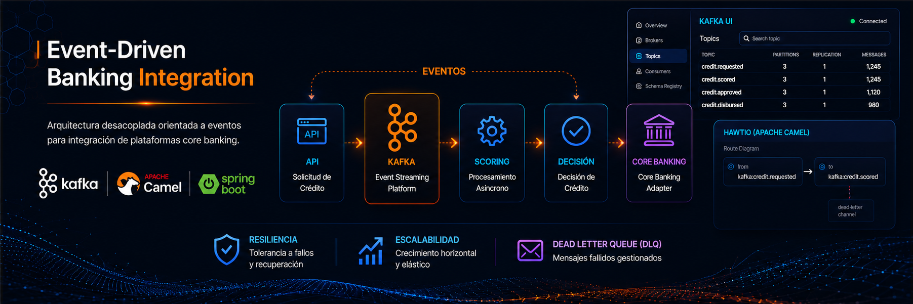
Arquitectura de integración enterprise basada en eventos utilizando Apache Kafka, Apache Camel y Spring Boot para simular procesamiento desacoplado de plataformas core banking.

## Características principales

- Arquitectura orientada a eventos
- Mensajeria distribuida con Apache Kafka
- Rutas de integración con Apache Camel
- Dead Letter Queue (DLQ)
- Estrategias de reintento
- Procesamiento concurrente
- Consumer Groups
- Entorno Dockerizado
- Kafka UI + Hawtio Monitoring

## 1. Problema del negocio: ##

### 1.1. Situación actual: ###
Los sistemas core bancarios legacy presentan:
- alto acoplamiento
- integraciones síncronas frágiles
- baja escalabilidad
- dificultad para incorporar nuevos canales digitales

### 1.2. Propuesta
Implementar una arquitectura event-driven desacoplada basada en Apache Kafka y Apache Camel para separar decisiones de negocio, integración y procesamiento operacional.

### 1. 3. Beneficios
- Resiliencia ante fallas del Core Banking
- Integración desacoplada
- Escalabilidad independiente
- Reprocesamiento seguro
- Mayor observabilidad
- Evolución incremental
- Menor impacto en sistemas legacy

### 1.4. Capacidad futura
La arquitectura permite incorporar nuevos consumidores de eventos sin afectar servicios existentes:
- fraude
- analytics
- auditoría
- machine learning
- omnicanalidad

## 2. Visión de Solución ##

## 3. Arquitectura de solución / Arquitectura Lógica ##

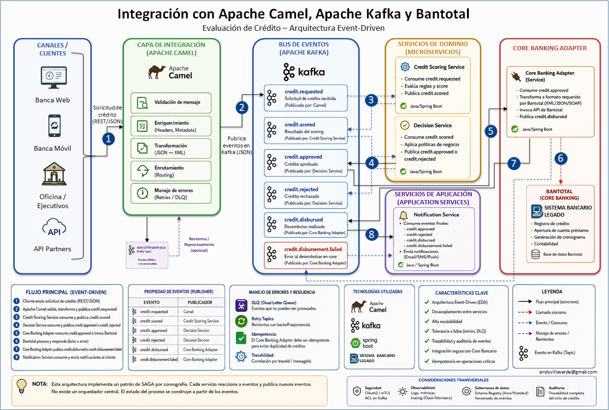
## Flujo de Arquitectura
1. Recepción de solicitud de crédito vía REST API
2. Validación funcional y publicación del evento en Kafka
3. Consumo del evento por el servicio de scoring
4. Procesamiento asíncrono y publicación del resultado de scoring
5. Consumo del resultado y generación de decisión crediticia
6. Integración con Core Banking para registro de operación
7. Publicación del evento de desembolso
8. Servicio de notificaciones comunica resultado al cliente

## Conceptos Enterprise Aplicados
- Arquitectura Orientada a Eventos (Event-Driven)
- Patrones de Integración Empresarial
- Bajo Acoplamiento
- Mensajería Distribuida
- Tolerancia a Fallos
- Estrategias de Reintento y Reenvío
- Cola de Mensajes Fallidos (Dead Letter Queue - DLQ)
- Escalabilidad Horizontal
- Procesamiento Asíncrono
- Procesamiento Concurrente

## 4. Implementación Incremental ##
### 4.1. Fase 1 Conectividad Core-to-Event Hub (SOAP a Kafka) ###
Demostrar el flujo EDA básico.

**4.1.1. Componentes:**

| Categoría | tecnología | Descripción | Notas técnicas |
| :--- | :--- | :--- | :--- |
| **Integración** | Spring boot/Apache Camel | Microservicio de integracion de canales a bus de eventos |Archivo docker-compose.yml container_name: kafka-ui-EB |
| **Bus de eventos** | Apache Kafka | Servicio Kafka que implementa bus de eventos |Archivo docker-compose.yml container_name: kafka-EB Imagen oficial de Docker para kafka container_name: kafka-ui-EB: Una interfaz web para monitorizar clústeres de Apache Kafka |
| **Servicio de dominio** | String boot/Apache Camel | Microservicio de Scoring de credito |Archivo docker-compose.yml container_name: credit-scoring-service |

**4.1.2. Quick Start:**
- Instalar docker en el PC  
- Crear un directorio en el PC, por ejemplo arquitectura_camel_kafka  
- Descargar los proyectos integracionCamel y credit-scoring-service y ubicarlos dentro del directorio arquitectura_camel_kafka  
- Desde el cmd ingresar al directorio arquitectura_camel_kafka  
- Ejecutar el comando docker compose up --build  
- Validar la ejecucion de los contenedores dockers
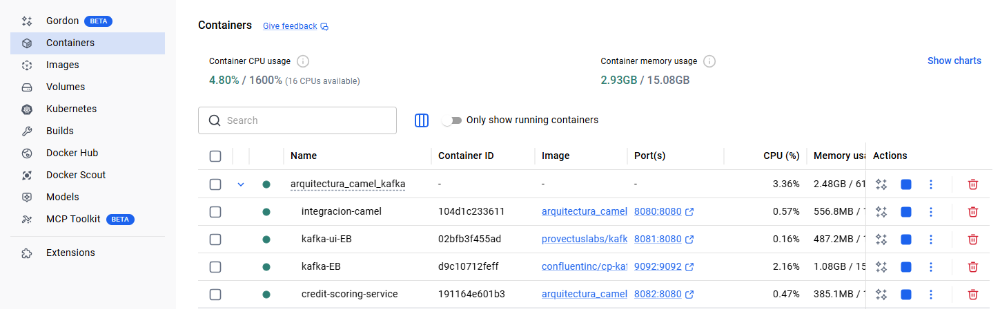

**4.1.3. Operacion:**

**Realizar un request a través de Soap UI**
- Ingresar url http://localhost:8080/api/credit/request
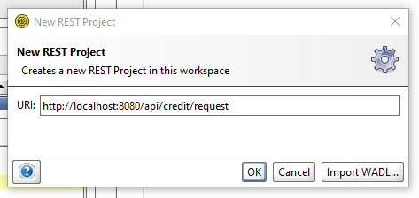
- Llenar los datos del mensaje Customerid=C003
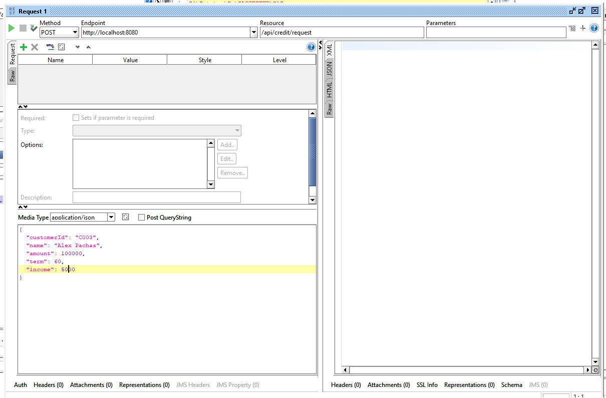
- Ejecutar request y validar respuesta
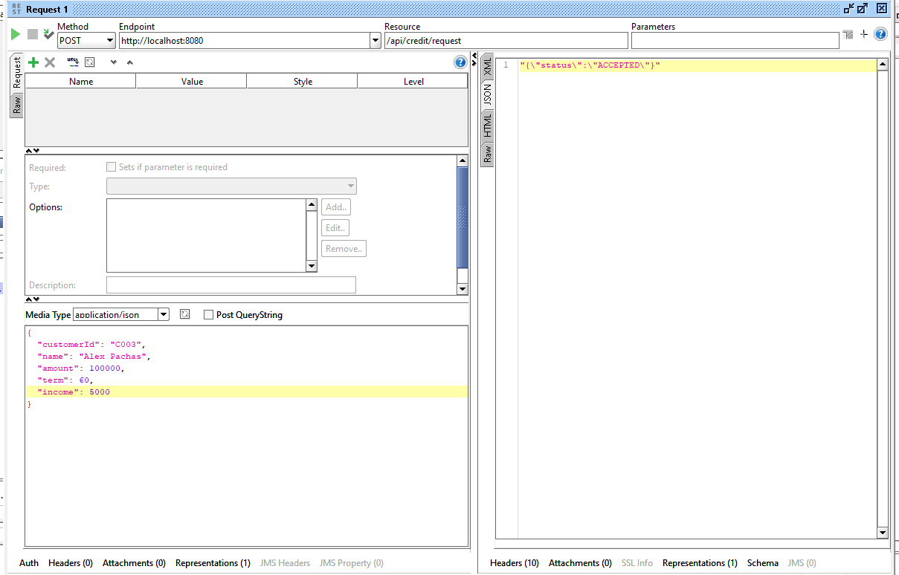

**Validar el viaje de los mensajes a través de los Topics kafka**
- Ingresar a kafka UI, ingresar a la siguiente url http://localhost:8081/
- Luego seleccionar la opcion Topics, se visualizará las Topics creadas
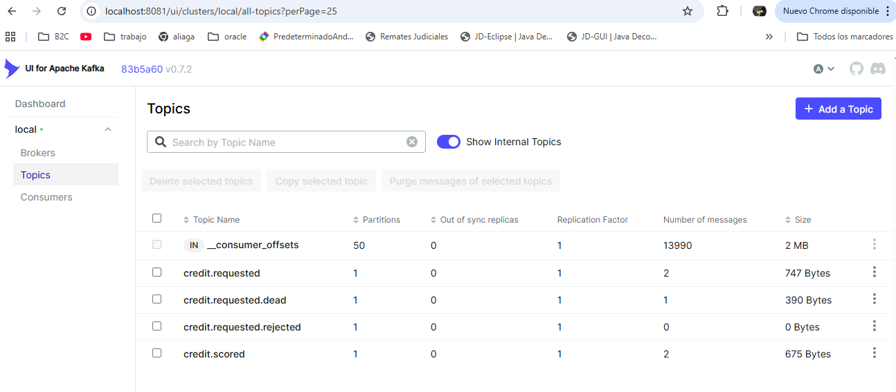  
- Seleccionar el topic credit.requested, luego clic en la pestaña Messages, seleccionamos un mensaje, luego visualizaremos el request almacenado en el topic, esto valida la recepcion del mensaje en el topic de kafka

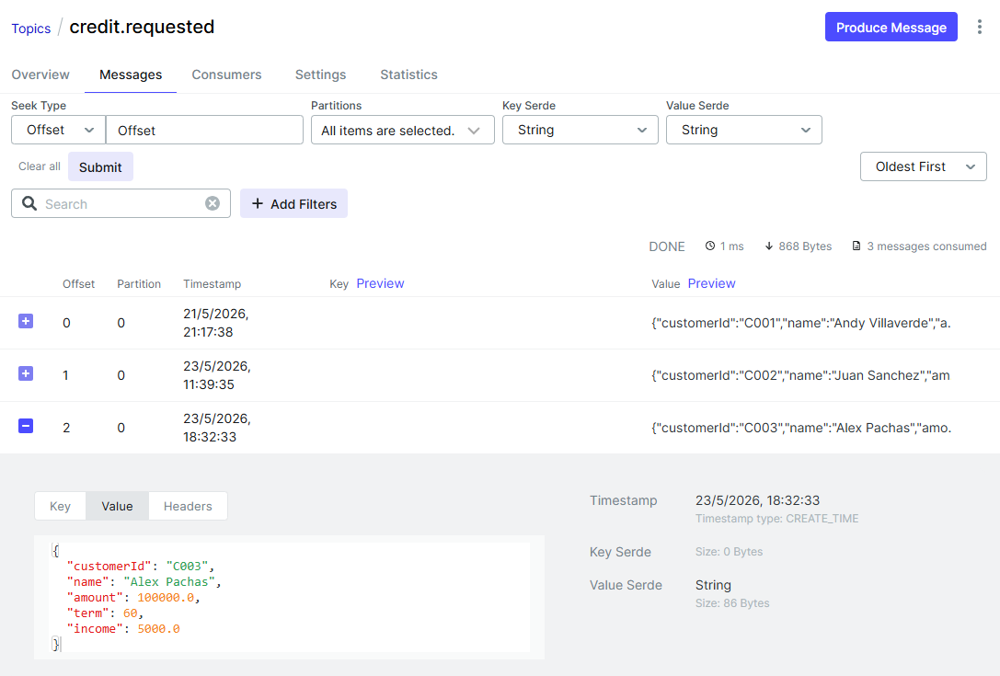
- Seleccionar el topic credit.scored, luego clic en la pestaña Messages, visualizaremos el mensaje publicado del scored, aqui se puede verificar que el mensaje generado es de diferente tipo, el contenido es generado por el microservicio scored
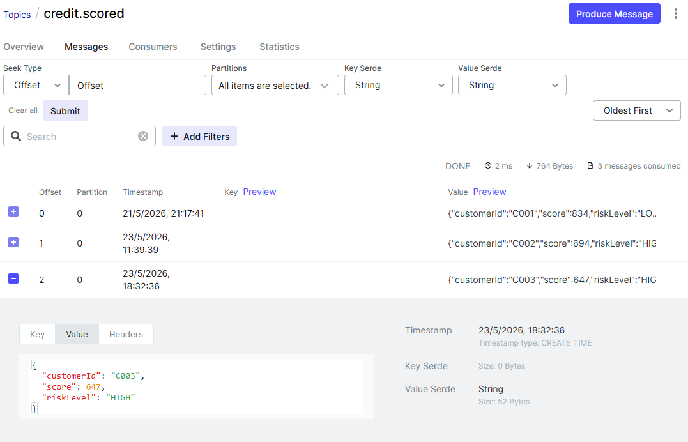

**Revisión de flujos Camel en Hawtio**
- Ingresar a la consola de Hawtio, ingresar la siguiente URL http://localhost:8080/actuator/hawtio/camel/contexts
- Seleccionar la opcion de menu Camel
- En el explorador seleccionar credit-request-route
- En el lado izquierdo selecciona la pestaña Route Diagram
- Se va a visualizar el route de forma grafica, asi como las diferentes rutas que puede tomar
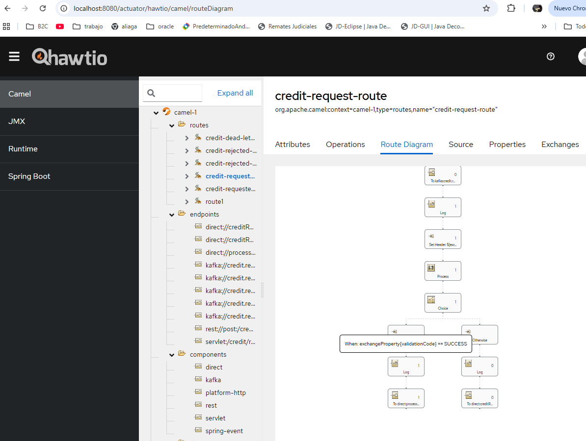
- Para  visualizar la cantidad de mensajes que has sido procesados en cada etapa del route, asi como el tiempo que tomó en ser procesado, se debe colocar el cursor sobre el cuadro que se desea analizar
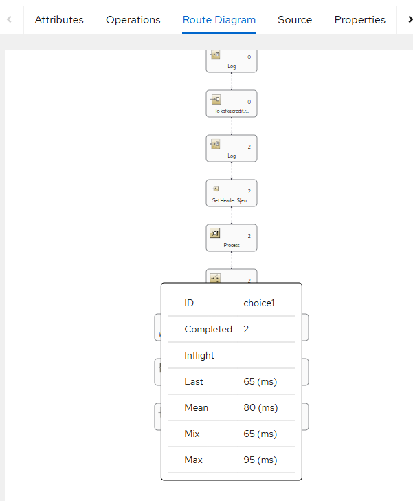

### 4.2. Fase 2 Integración Core Banking ###
Incorporación de adaptador Core Banking para desacoplar integración legacy.
- Consumo de eventos credit.scored
- Generación de eventos credit.approved
- Simulación de integración Bantotal
- Publicación de eventos credit.disbursed

### 4.3. Fase 3 — Notification Service
Consume eventos finales.

### 4.4. Fase 4 — Resiliencia
Agrega:
- retries
- DLQ
- idempotencia

### 4.5. Fase 5 — Observabilidad
- correlation-id
- tracing
- logs estructurados
